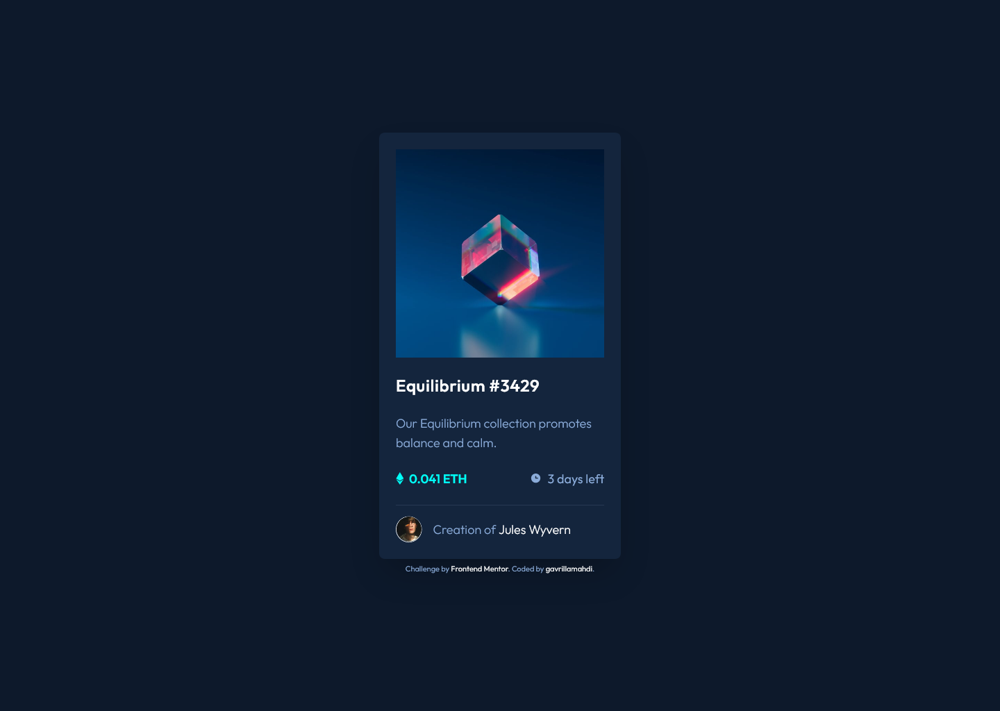

# Frontend Mentor - NFT preview card component solution

Hello, my name is [gavrillamahdi](https://github.com/gavrillamahdi) and this is my solution to the [NFT preview card component challenge on Frontend Mentor](https://www.frontendmentor.io/challenges/nft-preview-card-component-SbdUL_w0U). Frontend Mentor challenges help me improve my coding skills by building realistic projects.

## Table of contents

- [Overview](#overview)
  - [The challenge](#the-challenge)
  - [Screenshot](#screenshot)
  - [Links](#links)
- [My process](#my-process)
  - [Built with](#built-with)
  - [What I learned](#what-i-learned)
- [Author](#author)

## Overview

### The challenge

Users should be able to:

- View the optimal layout depending on their device's screen size
- See hover states for interactive elements

### Screenshot

Here the screenshot of my web for the solution I've built

#### Desktop (1440px)

#### Mobile (375px)

  

### Links

- Live Site URL: [NFT preview card component](https://github.com/gavrillamahdi/nft-preview-card-component-main)

## My process

### Built with

- HTML5
- Mobile-first workflow
- CSS Flexbox
- [Tailwind CSS](https://tailwindcss.com/) - CSS framework

### What I learned

This challenge was build to learn [Tailwind CSS](https://tailwindcss.com/) as now [Tailwind CSS](https://tailwindcss.com/) is one of the most popular CSS framework. In the past, I've used [Bootstrap](https://getbootstrap.com/) as my CSS and JS framework. But after I work on this challenge I found out [Tailwind CSS](https://tailwindcss.com/) is more easy to use and easy to customize for building website.

In this challenge I learn a lot from [Tailwind CSS Documentation](https://tailwindcss.com/docs/installation) to define the classes for every CSS property. This challenge is pretty simple I think, to get started and adjust with [Tailwind CSS](https://tailwindcss.com/) environment. I'm aware that there still a lot of things to learn from this CSS framework, and I'm looking forward to study more and more!

**Note: I'm so sorry for my bad English XD. I'm still learning to it ✌**

## Author

- Frontend Mentor - [@gavrillamahdi](https://www.frontendmentor.io/profile/gavrillamahdi)
- Instagram - [@gavrillamahdi](https://www.instagram.com/gavrillamahdi/)
